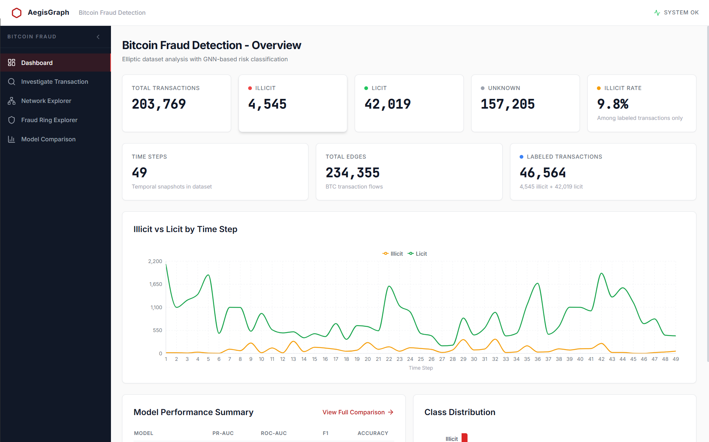
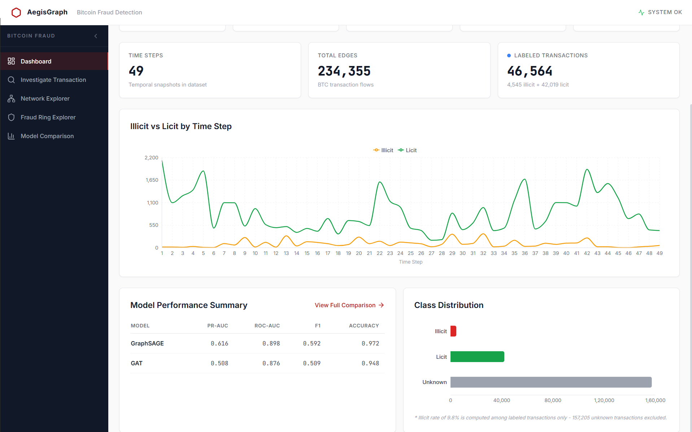
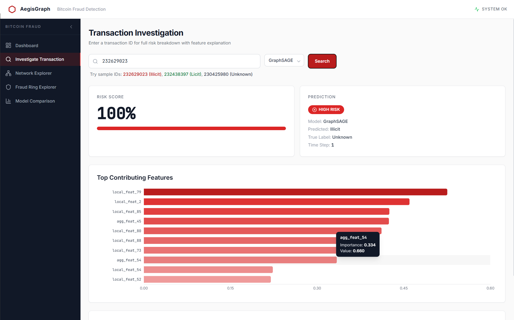
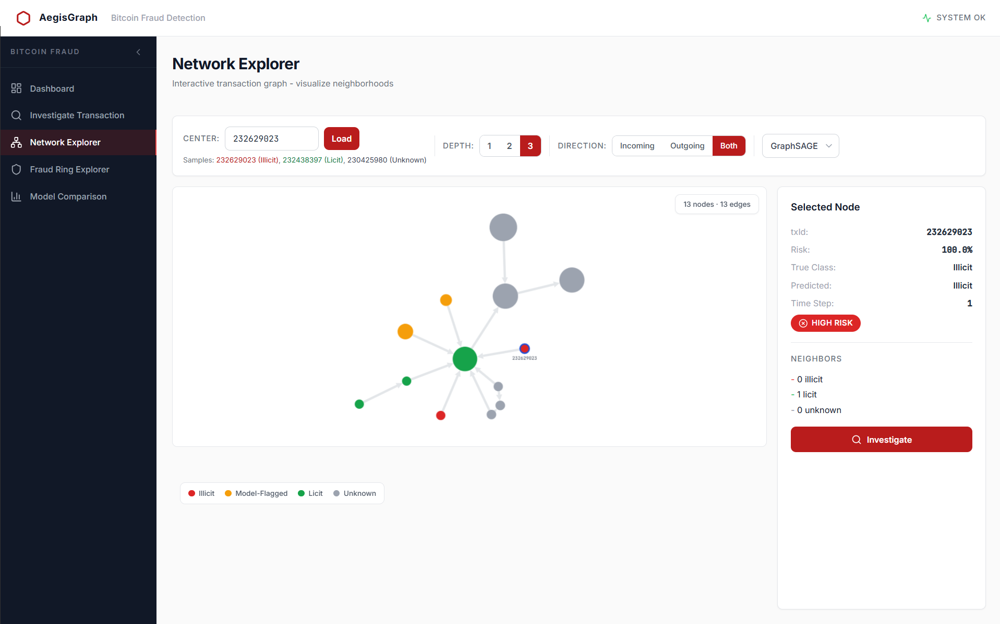
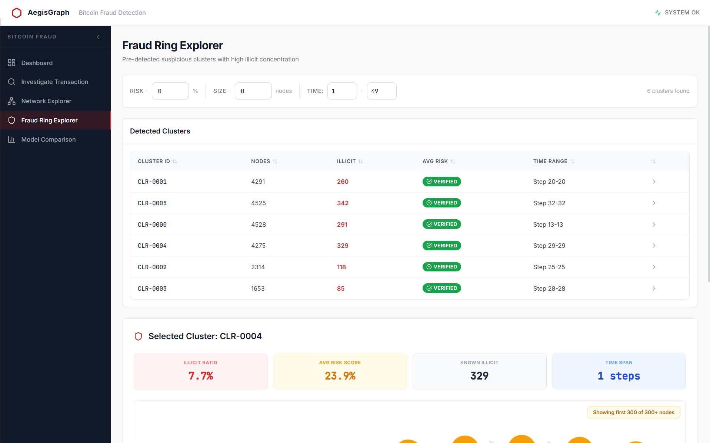
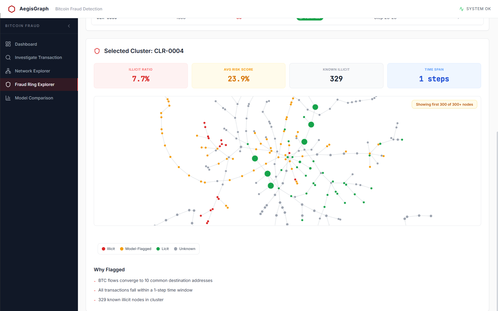
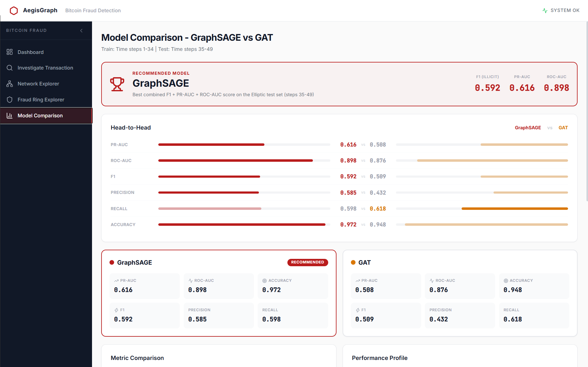
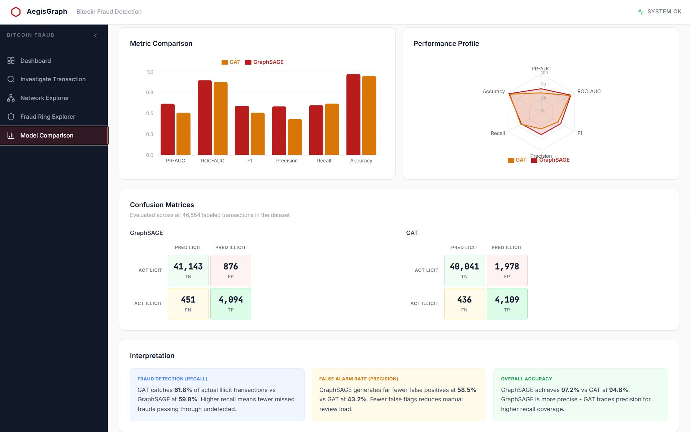

# AegisGraph - Adaptive Graph Intelligence for Adversarial Payment Fraud

**Team GangZero | Mastercard Innovation Challenge 2026**

This project is an end-to-end Red Team / Blue Team system that uses **Graph Neural Networks (GNNs)** to identify, simulate, and defend against complex Generative AI fraud vectors on payment networks.

## Frontend Demo

### Dashboard - Dataset Overview
A bird's-eye view of the full Elliptic dataset: 203,769 transactions across 49 time steps, with live model performance cards and an illicit vs licit trend chart.

### Investigate Transaction
Enter any transaction ID to get an instant GNN risk score, a HIGH/LOW RISK verdict, and a ranked bar chart of the top contributing features.

### Network Explorer
Visualize the neighborhood graph of any transaction up to 3 hops deep. Nodes are color-coded by class (illicit, licit, model-flagged, unknown) and a side panel shows per-node details.

### Fraud Ring Explorer
Browse pre-detected suspicious clusters ranked by illicit count. Select a cluster to see its stats (illicit ratio, avg risk, time span) and its full subgraph rendered interactively.

### Model Comparison - GraphSAGE vs GAT
Side-by-side head-to-head metrics, a grouped bar chart, a radar performance profile, and full confusion matrices for both models evaluated on the held-out test set (steps 35-49).

## Documentation

To help you understand our approach, architecture, and the models powering AegisGraph, we have broken down our technical documentation into clean, digestible guides

- **[Master Solution Walkthrough](docs/Solution_Walkthrough.md)** An executive brief covering the entire project from end to end
- **[1. GenAI Attack Vectors](docs/1_Attack_Vectors.md)** A deep dive into the novel AI-driven fraud patterns we identified (e.g., Mule Orchestration, Cross-Border Layering) and how they bypass traditional rules
- **[2. Graph Neural Networks](docs/2_Graph_Neural_Networks.md)** Why we chose GNNs over traditional tabular models like Random Forest, and how we solved massive class imbalances and temporal data leakage
- **[3. System Architecture and Prototype](docs/3_System_Architecture.md)** An overview of our low-latency inference flow, subgraph extraction API, and interactive React dashboard

## Project Structure
- `backend/` FastAPI application, BFS subgraph extraction, and PyTorch Geometric inference
- `frontend/` React 19 + Cytoscape.js interactive dashboard
- `notebooks/` Exploratory data analysis, baseline model comparisons (RF vs LR), and GNN training scripts
- `data/` Sample partitions of the Elliptic Bitcoin dataset
- `docs/` All documentation files linked above
